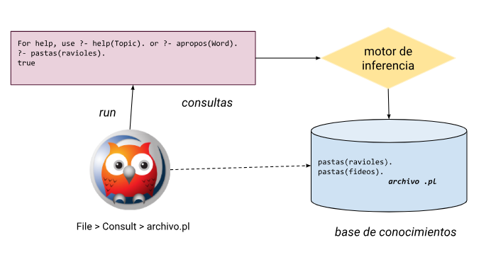

# Clase 1

Introducción al paradigma lógico y Prolog

- `swipl main.pl` -> ejecuto archivo
- `halt.` -> Salgo
- `make.` -> Hago cambios en Visual Studio Code, para refrescar


## Paradigma Lógico

El paradigma lógico es un enfoque de programación que se basa en la lógica formal y el razonamiento deductivo. En este paradigma, se describe el problema a resolver utilizando un conjunto de reglas lógicas y hechos, y se utiliza un motor de inferencia para derivar conclusiones lógicas a partir de ellos.

En lugar de especificar cómo se debe resolver un problema paso a paso, como en otros paradigmas como el imperativo, en el paradigma lógico se describe el problema en términos de relaciones lógicas y restricciones, y el motor de inferencia se encarga de encontrar soluciones lógicamente consistentes.

## Definir el conocimiento

El código que escribamos en el archivo va a ser una base de conocimiento, que define el alcance, lo que forma parte de nuestro universo de cosas conocidas y lo que no.

```Prolog
pastas(ravioles).
pastas(fideos).
```

## Predicados e individuos

La base de conocimiento se conforma de predicados. Si el predicado tiene aridad 1 (un solo individuo participa de la relación) se lo llama monádicos.

Los individuos son los elementos que forman parte del universo posible de los predicados.

## Consulta

La inferencia es el proceso por el cual se derivan conclusiones a partir de premisas.

```Prolog
? pastas(ravioles).
true

? pastas(fideos).
true
```

Es importante el punto `.` para delimitar el final de la consulta.



## Principio de universo cerrado

Si hacemos una consulta y los individuos no estan dentro del alcance, Prolog me va a devolver `False`. Se puede tomar como que ese individuo no cumple con el predicado o que es desconocido.

```Prolog
? pastas(pechitoCerdo).
false

? pastas(ñoquis).
false
```

Vamos a tomar todo lo desconocido como falso.

Vamos a llamar un **hecho** a una afirmación codificada en la base de conocimiento. Cada hecho es una **clausula**.

## Predicados poliádicos

Los predicados que tienen mas de un argumento se llaman poliádicos, ya que expresan relaciones entre individuos.

**Tip**: es conveniente escribir las definiciones de un mismo predicado en forma contigua, y no intercalar definiciones de otros predicados.

## Definición por extensión

Un conjunto de hechos para el mismo predicado forman la definición por extensión del predicado.

Ej: Animales = "Tigre", "Oso", "Elefante"

```Prolog
animal(tigre).
animal(oso).
animal(elefante).
% Animales = { tigre, oso, elefante }
```

Este tipo de definición requiere que enumeremos todos los elementos del conjunto.

## Resumen

En nuestra primera aproximación al Paradigma Lógico, hemos visto que las soluciones que vamos a encarar son declarativas: escribimos conocimiento partiendo de las características de los individuos o de las relaciones entre ellos en una base de conocimientos. Luego podemos realizar diferentes consultas delegando al motor de inferencia la forma en que finalmente lo resuelve.

La base de conocimientos compone todo el universo conocido, todo lo que está fuera no se puede probar que existe, por lo tanto se asume falso según el Principio de Universo Cerrado.
